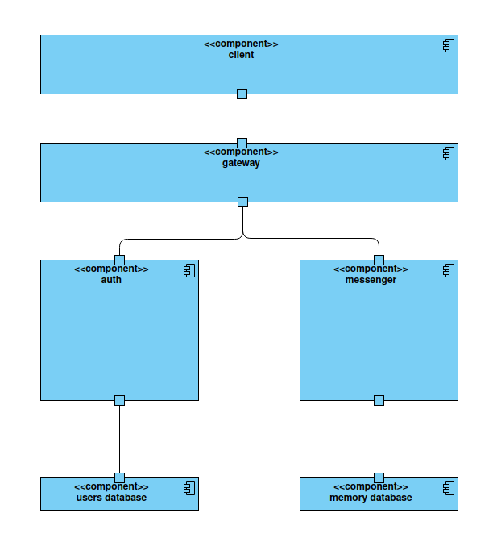
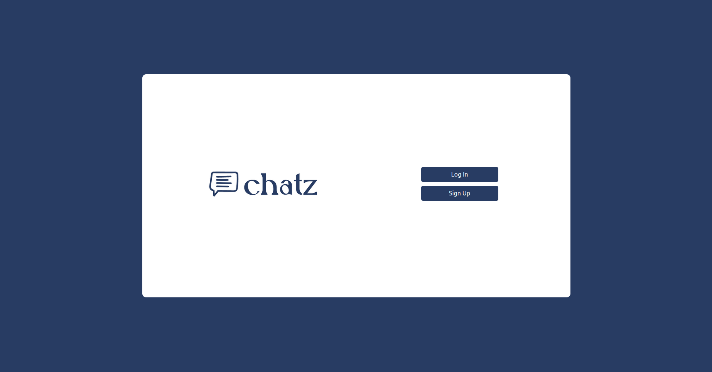
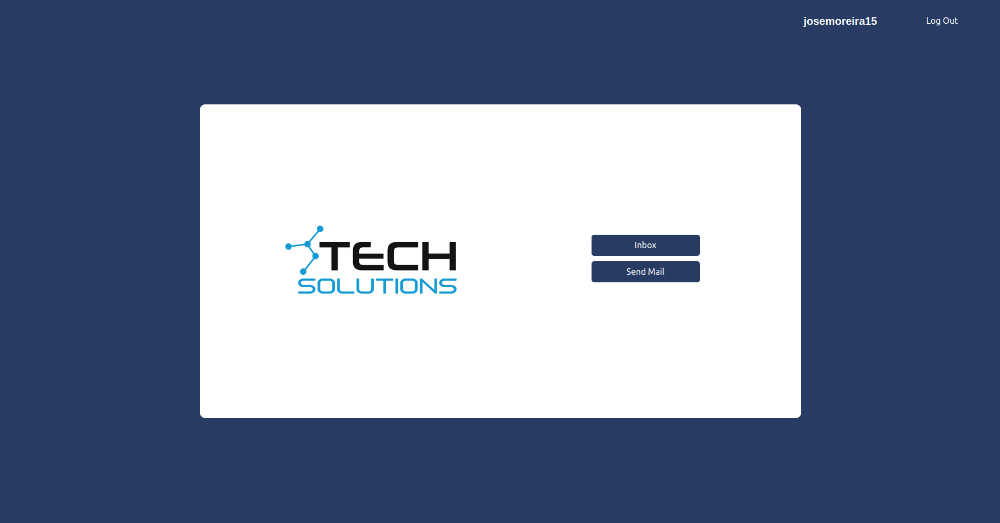
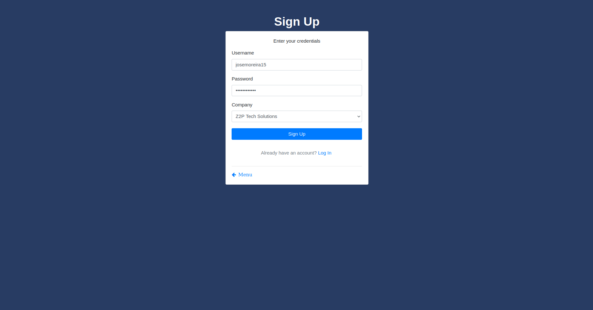
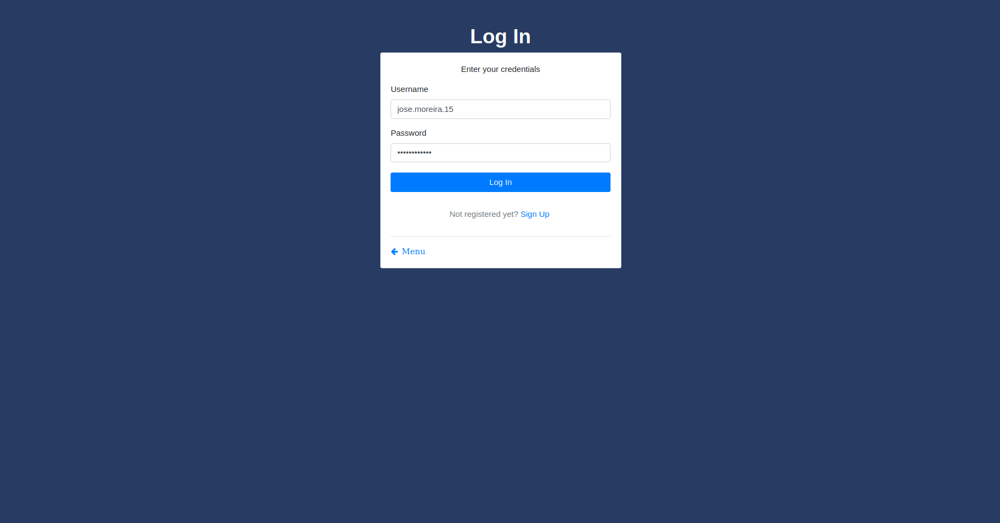
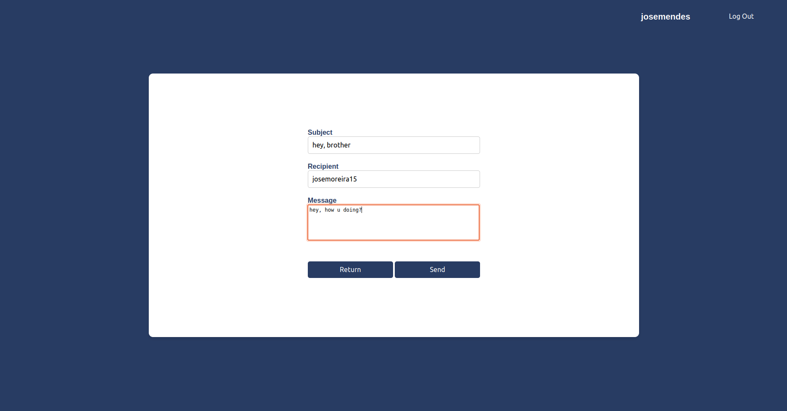
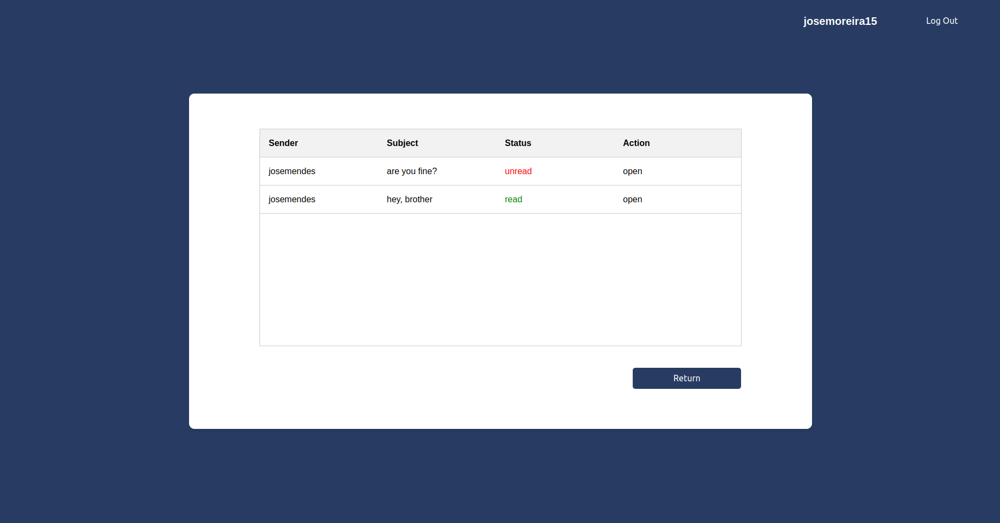
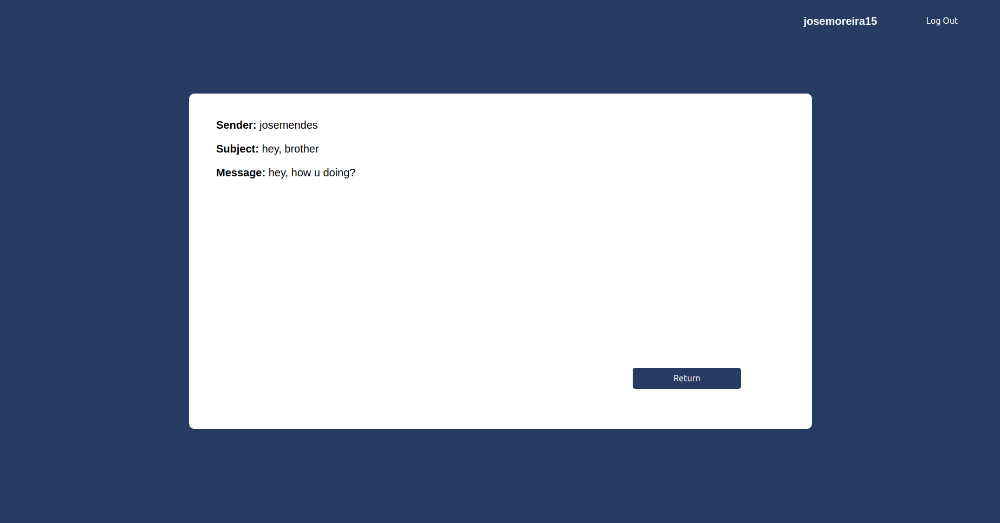

# Engenharia de Segurança - Projeto de Desenvolvimento II
## Mestrado em Engenharia Informática
## Projeto desenvolvido por:
* José de Matos Moreira (PG53963)
* José Mendes (PG53967)

# Introdução
O projeto em descrição, neste relatório, surge devido ao sucesso do primeiro serviço desenvolvido. Inicialmente, projetou-se e desenvolveu-se um serviço de troca de mensagens que permitisse aos membros de uma organização trocarem mensagens com garantia de autenticidade. Esse mesmo serviço destinou-se a ser utilizado por uma das empresas do grupo **Z2P**, a **Z2P Health Care** e, uma vez que a direção da mesma adorou o produto encomendado, decidiram partilhar a experiência com a empresa mãe, que decidiu encomendar um produto idêntico, com um âmbito alargado a todas as empresas do grupo. Deste modo, desenvolveu-se o **chatZ**, um serviço sólido e confiável que permite a todos os membros das diversas empresas do grupo **Z2P** trocarem mensagens de uma forma simples, segura e rápida. Passa-se, portanto, a explicar o desenvolvimento de todo o projeto, abordando temas como arquitetura, segurança, implementação e interface gráfica.

# Arquitetura
O produto desenvolvido tem, por base, uma arquitetura baseada em microsserviços. A decisão foi impulsionada por diferentes vantagens, entre as quais:
* **escalabilidade**: a arquitetura baseada em microsserviços assume um melhor comportamento em relação à escalabilidade, na medida em que cada microsserviço pode ser escalado de forma independente, alocando recursos de uma forma dinâmica e otimizada
* **performance**: tratando-se de um produto desenvolvido para uma empresa com um grande número de funcionários, a adoção de uma arquitetura baseada em microsserviços mostra-se mais eficiente na medida em que lida melhor com momentos de grande utilização, conseguindo dar resposta de uma forma mais rápida e eficaz
* **manutenção**: a manutenção/atualização de um microsserviço não mostra impacto em qualquer outro, o que permite que o serviço funcione sem interrupções
* **capacidade de evolução**: uma arquitetura deste caráter permite que a aplicação possa ser alargada e modificada, de uma forma mais prática e simples, tanto a pedido da empresa, como por necessidade
* **resiliência**: a falha de um microsserviço não afeta (salvo raras excecões) a atividade de outro, o que representa um fator importante na medida em que se pretende uma aplicação que consiga funcionar sempre

Por todas as razões enunciadas, desenvolveu-se uma arquitetura que assenta em quatro microsserviços: **auth**, **client**, **gateway** e **mesenger**, que comunicam entre si através do protocolo **HTTP**. Passa-se, portanto, a explicar as principais funções de cada um dos mesmos:
* **auth**: microsserviço responsável pela autenticação dos utilizadores. É o **auth** que guarda as informações das diversas contas, sendo o mesmo contactado quando há necessidade de registar um utilizador novo ou quando um utilizador já registado pretende iniciar sessão na sua conta
* **client**: microsserviço que fornece a interface gráfica e que interage diretamente com os utilizadores
* **gateway**: microsserviço com funções de **proxy**, ou seja, que estabelece a comunicação entre o microsserviço **client** e os outros dois
* **messenger**: microsserviço responsável pelas funcionalidades da aplicação, sendo contactado nas diversas ocasiões de envio e leitura de mensagens. É, portanto, o microsserviço responsável por armazenar as diversas mensagens trocadas entre utilizadores

   
  

# Segurança
Todo o projeto foi desenvolvido com o principal foco na segurança. Tal como o primeiro serviço implementado, o **chatZ** zela pela confidencialidade, integridade e autenticidade das mensagens trocadas. Isto acontece uma vez que não faria sentido implementar um serviço de troca de mensagens que não conseguisse preservar e respeitar a privacidade dos utilizadores. Portanto, efetuou-se uma análise de riscos extremamente rigorosa durante todas as fases de desenvolvimento do produto. Isto permitiu identificar as diferentes ameaças em fases prematuras da codificação do serviço, o que contribuiu positivamente para o desenvolvimento do mesmo. Passa-se, então, a mostrar a análise efetuada, que se baseou no modelo **STRIDE**.

## Análise de Risco

### Spoofing
Um atacante pode explorar este tipo de ataque, ganhando a capacidade de enviar mensagens em nome de outro utilizador ou de ler mensagens que não lhe são destinadas.

### Tampering
Um atacante pode manipular os pacotes que são trocados entre os microserviços. Também pode manipular as mensagens presentes na base de dados do **messenger**.

### Repudiation
Um dos microsserviços pode negar alguma ação, levando a sérios problemas de confiança no serviço.

### Information Disclosure
O conteúdo confidencial das mensagens trocadas pode ser intercetado por um atacante nas diversas fases de transporte da mensagem e no seu local de armazenamento.

### Denial of Service
Um atacante pode enviar pacotes **HTTP**, numa quantidade excessiva, para os diversoes microsserviços, levando a que o serviço falhe ou apresente degradação.

### Elevation of Privilege
Um atacante pode tentar ganhar privilégios sobre qualquer um dos microsserviços, tendo, assim, acesso a informações críticas e ações extremamente poderosas.

# Implementação
Nesta fase do relatório, explicam-se, de uma forma aprofundada, as diferentes particularidades do projeto desenvolvido. Aqui, detalham-se, também, as abordagens feitas com base na análise de risco anteriormente apresentada. Dá-se, portanto, desta forma, a conhecer a íntegra do **chatZ**.

## Comunicação
Todos os microsserviços comunicam através do protocolo **HTTP**. Porém, nem todos comunicam entre si. O microsserviço **client** apenas comunica com o **gateway**. O mesmo é o responsável por "transmitir" os diferentes pedidos do **client**, comunicando, assim, com o **auth** e com o **messenger**. Estes dois últimos, portanto, apenas recebem pacotes enviados pelo **gateway** (ou, de uma forma mais correta, apenas aceitam pacotes do **gateway**).

## Contas
Aqui, aborda-se a forma como as contas dos utilizadores são criadas e geridas. Quando um utilizador se regista, com o **client**, o mesmo procede ao *hash* da sua password, recorrendo ao **bcrypt**, e a um pequeno processo de *salting* (para aumentar a segurança da mesma, evitando *dictionary attacks*, por exemplo). Posteriormente, a informação é passada até ao **auth**, que verifica se o *username* se encontra disponível, retornando um erro em caso contrário. Caso tudo corra bem, este mesmo microsserviço gera um par de chaves **RSA** e, guardando a chave pública com a informação de registo, retorna a chave privada, de forma a que ela seja guardada no dispositivo do utilizador (aqui, a mesma é guardada numa pasta acessível ao **client**).

## Autenticação
Quando ocorre um pedido de autenticação, por parte de um utilizador, com o **client**, o mesmo passa a informação de *login* até ao **auth**. O mesmo verifica se a informação está correta (retornando um erro em caso contrário) e, através de uma chave secreta, gera um *token*, recorrendo ao **jwt**, que é devolvido até ao *client*. Este *token* é mantido neste útlimo microsserviço até que o utilizador proceda a um pedido de *logout* e é anexado a todos os pedidos **HTTP** que são enviados do **client** para o **gateway** (à exceção dos pedidos que não requerem *token*, como é o caso do *login*), nos *headers* do mesmo, para que consiga verificar os pacotes que lhe são enviados. Como seria de esperar, este processo ocorre também aquando o processo de registo, uma vez que o *login* está incorporado no mesmo.

Por outro lado, os microsserviços também recorrem a um processo de autenticação. Uma vez que o **auth** e o **messenger** apenas aceitam pedidos do **gateway**, este último, quando quer comunicar com os mesmos, envia um *token* gerado pelo próprio, de forma a que eles confiem naquilo que lhes é enviado e respondam de forma correta. Este *token* é, constantemente, verificado pelo **gateway**, de forma a garantir que o mesmo é sempre válido (sendo novamente gerado quando deixa de o ser).

## Persistência dos dados
Como seria de esperar, mostra-se necessário guardar diversa informação. Mais especificamente, o **auth** necessita de guardar as informações sensíveis dos utilizadores, enquanto que o **messenger** precisa de guardar as diferentes mensagens trocadas. Adianta-se que ambos recorrem a um ficheiro, em formato *json* (**users.json** e **memory.json**, respetivamente), apresentando-se a estrutura de cada um dos mesmos:

### users
Dicionário, sendo as suas chaves os **usernames** dos utilizadores. Cada chave tem como valor um outro dicionário, constituído pelas chaves **password** (cujo valor é a *password*), **company** (cujo valor é a empresa do grupo **Z2P** à qual o utilizador pertence), **public_key** (cujo valor é a chave pública associada ao utilizador) e **status** (cujo valor é uma *string* que pode assumir os valores *online* e *offline*).

### memory
Dicionário, sendo as suas chaves os **usernames** dos utilizadores. Cada chave tem como valor um dicionário, constituído pelas chaves **read** (cujo valor é uma lista de mensagens lidas) e **unread** (cujo valor é uma lista de mensagens por ler). As mensagens são representadas por dicionários com as seguintes chaves: **id** (cujo valor é o *id* único da mensagem), **sender** (cujo valor é o *username* do utilizador que enviou a mensagem), **subject** (cujo valor é o assunto da mensagem) e **secret** (cujo valor é a mensagem cifrada, através de um processo que será explicado numa fase posterior).

## Troca de mensagens entre utilizadores
Quando um utilizador pretende enviar uma mensagem, o mesmo refere a quem pretende enviar a mensagem e qual o assunto da mesma. Com isto, o **client** processa a informação e envia o **username** do destinatário até ao **auth**, para que o mesmo lhe devolva a sua chave pública. Após receber a mesma, o **client** permite ao utilizador digitar a mensagem a enviar e cifra-a, enviando toda a informação requisitada até ao **messenger**. Após todas as verificações (havendo retorno de erro caso algo corra mal), o **messenger** guarda o conteúdo da mensagem na lista de mensagens não lidas do utilizador destinatário.

Por outro lado, quando um utilizador quer ver as mensagens recebidas, visita a sua **inbox**, onde lhe são apresentadas as informações das mensagens que possui. Quando escolhe uma das mensagens, o **client** requisita, ao **messenger**, o conteúdo da mensagem e, através da chave privada do utilizador, decifra o segredo contido na mensagem, apresentando a mesma para que o utilizador a possa ler. O **mesenger**, de forma a manter a coerência, passa a referida mensagem para a lista das mensagens lidas (caso ainda não se encontrasse lá).

## Criptografia
O processo de cifragem das mensagens é inspirado no **Javascript Object Signing and Encryption**. Quando o **client** possui uma mensagem para enviar (até ao microsserviço **messenger**), o mesmo aplica-lhe o seguinte processo:
* carregamento da chave pública (da forma já mencionada)
* geração de **IV** e **nonce**
* configuração do **AES-GCM**
* cifragem da mensagem, gerando um segredo e uma **tag** de autenticação
* cifragem do **IV**, recorrendo à chave pública
* codificação do texto cifrado, do **IV**, da **tag** e do **nonce**, em **Base64**
* concatenação dos objetos codificados através do '.'

Em sentido contrário, quando um utilizador pretende ler uma mensagem, o seguinte processo ocorre, também no **client**:
* carregamento da chave privada
* divisão e decodificação, gerando os componentes texto cifrado, **IV**, **tag** e **nonce**
* decifragem do **IV**, através da chave privada
* configuração do **AES-GCM**
* decifragem do texto cifrado, retornando a mensagem

Como seria de esperar, qualquer erro num destes processos é devidamente tratado.

# Interface gráfica
De modo a facilitar a interação entre o utilizador e o **client** e melhorar a experiência do primeiro, desenvolveram-se várias páginas **web**. Estas páginas foram desenhadas com o objetivo de serem intuitivas, responsivas e fáceis de utilizar, proporcionando uma interface gráfica agradável e funcional. Apresentam-se, assim, as diferentes páginas desenvolvidas.

## Página principal
Em primeiro lugar, apresentam-se as páginas principais do **chatZ**. As mesmas diferem na medida em que, na primeira, não há nenhum utilizador que tenha efetuado *login*, enquanto que, na segunda, há um utilizador que se encontra autenticado.

   
  

   
  

## Criação de conta
Aqui, apresenta-se a página que permite a criação de uma conta. Repare-se que o utilizador pode escolher a empresa do grupo **Z2P** à qual pertence.

   
  

## Login
Segue-se a página de *login*, onde o utilizador deve introduzir as credenciais que usou aquando a criação da sua conta.

   
  

## Enviar mensagem
Aqui, apresentam-se as duas páginas que são mostradas ao utilizador aquando o envio de uma mensagem. É importante referir que o utilizador apenas pode enviar uma mensagem para outro utilizador que esteja registado na aplicação.

   
  

   
  

## Caixa de correio
Nesta página, é onde o utilizador pode consultar as mensagens que se encontram na sua caixa de correio, conseguindo, também, visualizar quais já foram lidas e quais ainda não leu.

   
  

## Leitura de mensagem
Por último, apresenta-se a página que apresenta o conteúdo de uma mensagem específica. É, aqui, que o utilizador pode consultar a íntegra da mensagem.

   
  

# Conclusão
O projeto **chatZ** foi desenvolvido com o objetivo de oferecer uma comunicação segura e eficiente para as empresas do grupo **Z2P**. Utilizando uma arquitetura baseada em microsserviços, conseguiu-se criar um sistema modular que proporciona escalabilidade, alta performance, fácil manutenção e resiliência. A segurança foi uma prioridade desde o início, com a implementação de técnicas rigorosas de criptografia e autenticação, garantindo a confidencialidade, integridade e autenticidade das mensagens trocadas.

A análise de riscos realizada ao longo do desenvolvimento ajudou a identificar e mitigar potenciais ameaças, assegurando que o **chatZ** seja um serviço confiável. A interface gráfica foi projetada para ser intuitiva e fácil de usar, melhorando a experiência do utilizador e facilitando a interação com o sistema.

Em suma, o **chatZ** é mais do que um simples serviço de troca de mensagens: é uma ferramenta essencial para a comunicação corporativa no grupo **Z2P**, destacando-se pela sua segurança, eficiência e facilidade de uso.