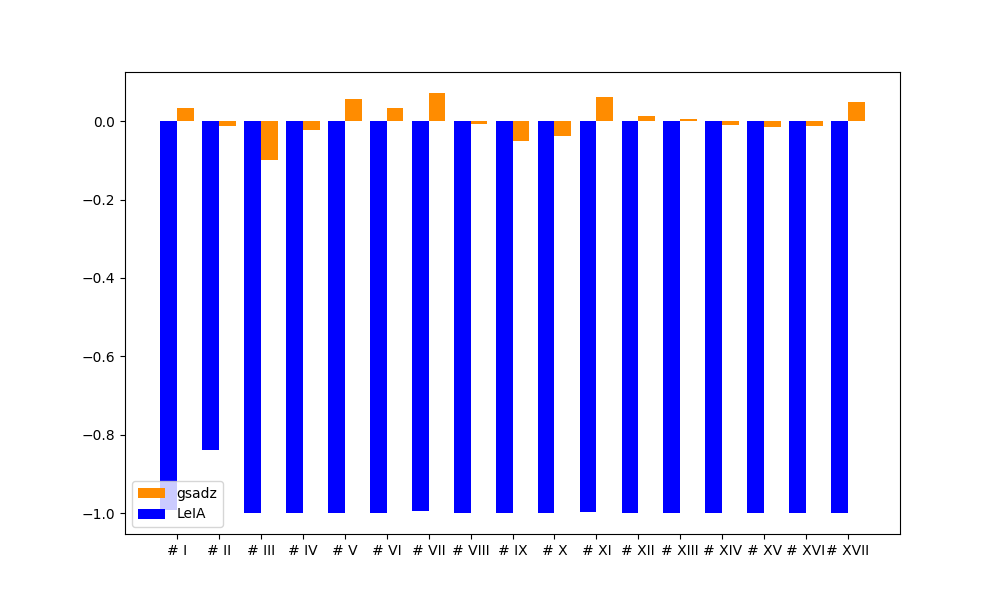
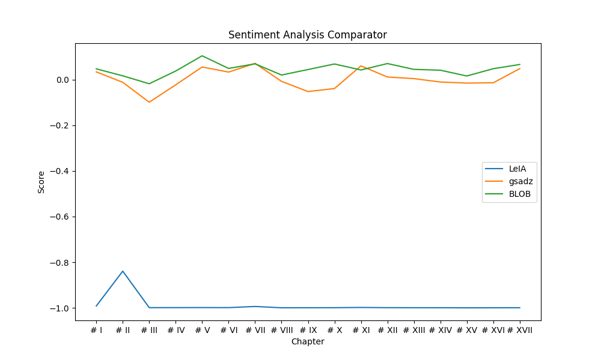

# GSADZ - Ferramenta para análise de sentimento

Módulo de *Sentiment Analysis* para o Português baseado em léxicos de sentimento.

**Modo de uso e interpretação do resultado**

    polarity1 = sa.polarity_result("És muito muito incrivelmente inteligente.")
    Polaridade do teste 1: {'Polarity': 1.5625, 'Words': 5, 'Puncts': 1, 'Boosters': 2, 'Deniers': 0, 'Positives': 1, 'Negatives': 0, 'Neutrals': 0}
~~~~~~~~~~~~~~
    polarity2 = sa.polarity_result("Não gosto nada de ti.")
    Polaridade do teste 2: {'Polarity': -1.0, 'Words': 5, 'Puncts': 1, 'Boosters': 0, 'Deniers': 1, 'Positives': 1, 'Negatives': 0, 'Neutrals': 0}
~~~~~~~~~~~~~~
    polarity3 = sa.polarity_result("O João dá de frosques.")
    Polaridade do teste 3: {'Polarity': -1.0, 'Words': 5, 'Puncts': 1, 'Boosters': 0, 'Deniers': 0, 'Positives': 0, 'Negatives':1 'Neutrals': 0}
~~~~~~~~~~~~~~
    polarity4 = sa.polarity_result("Sim!")
    Polaridade do teste 4: {'Polarity': 0.0, 'Words': 1, 'Puncts': 1, 'Boosters': 0, 'Deniers': 0, 'Positives': 0, 'Negatives': 0, 'Neutrals': 0}
~~~~~~~~~~~~~~
    polarity5 = sa.polarity_result("A vida é algo normal.")
    Polaridade do teste 5: {'Polarity': 0.75, 'Words': 5, 'Puncts': 1, 'Boosters': 1, 'Deniers': 0, 'Positives': 1, 'Negatives': 0, 'Neutrals': 0}
~~~~~~~~~~~~~~
    polarity6 = sa.polarity_result("Não sou feio.")
    Polaridade do teste 6: {'Polarity': 1.0, 'Words': 3, 'Puncts': 1, 'Boosters': 0, 'Deniers': 1, 'Positives': 0, 'Negatives': 1, 'Neutrals': 0}
~~~~~~~~~~~~~~
    polarity7 = sa.polarity_result("Às vezes, isso acontece.")
    Polaridade do teste 7: {'Polarity': 0.0, 'Words': 4, 'Puncts': 2, 'Boosters': 0, 'Deniers': 0, 'Positives': 0, 'Negatives': 0, 'Neutrals': 0}
~~~~~~~~~~~~~~
    polarity8 = sa.polarity_result("Sempre gostei da tua família.")
    Polaridade do teste 8: {'Polarity': 1.0, 'Words': 5, 'Puncts': 1, 'Boosters': 0, 'Deniers': 0, 'Positives': 1, 'Negatives': 0, 'Neutrals': 0}
~~~~~~~~~~~~~~
    polarity9 = sa.polarity_result("Detesto o que estás a fazer.")
    Polaridade do teste 9: {'Polarity': -1.0, 'Words': 6, 'Puncts': 1, 'Boosters': 0, 'Deniers': 0, 'Positives': 0, 'Negatives': 1, 'Neutrals': 0}
~~~~~~~~~~~~~~
    polarity10 = sa.polarity_result("Ela fez o teste e deu negativo, isso é positivo.")
    Polaridade do teste 10: {'Polarity': 0.0, 'Words': 10, 'Puncts': 2, 'Boosters': 0, 'Deniers': 0, 'Positives': 1, 'Negatives': 1, 'Neutrals': 0}
~~~~~~~~~~~~~~

Como se observa acima, o resultado obtido a partir das frase de teste é um dicionário com os seguintes campos:

* ``` Polarity ``` - Polaridade da frase
* ``` Words ``` - Número de palavras na frase
* ``` Puncts ``` - Número de pontos na frase
* ``` Boosters ``` - Número de léxicos ligados a *boosters* (intensidade) na frase
* ``` Deniers ``` - Número de léxicos ligados a *deniers* (negadores) na frase
* ``` Positives ``` - Número de palavras com polaridade positiva na frase
* ``` Negatives ``` - Número de palavras com polaridade negativa na frase
* ``` Neutrals ``` - Número de palavras com polaridade neutra na frase

Os valores da polaridade de uma frase variam entre positivo (maior do que 0), neutro (igual a 0) ou negativo (menor do 0)


**Gráfico de comparação entre as diferentes ferramentas**





**Corpus**

Cálculo dos termos que mais contribuem para o cálculo da polaridade.

*Nota*: O corpus utilizado foi obtido no website *https://www.corpusdata.org/portuguese.asp*, tendo sido cortado para aproximadamente 500 kbytes de forma a ser possível executar o programa.

| Polaridade | Nº de palavras | Pontuação | Boosters | Deniers | Positivas | Negativas | Neutrals |
| ---------- | -------------- | --------- | -------- | ------- | -------- | --------- | --------- |
| 0.026828450221759025 | 78272 | 16502 | 197 | 728 | 1410 | 1147 | 643
